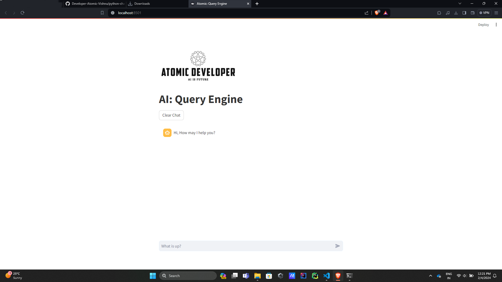

# AI Query Engine - Streamlit Frontend with GPT-35 Turbo LLM

## Table of Contents

* [Introduction to Project](#introduction-to-project)
* [Detailed Information](#detailed-information)
    * [Architecture](#architecture)
    * [Features](#features)
    * [Benefits](#benefits)
* [Installation Guide](#installation-guide)
    * [Prerequisites](#prerequisites)
    * [Setup Instructions](#setup-instructions)
    * [Running the Application](#running-the-application)
* [Contributing](#contributing)
* [License](#license)

## Introduction to Project

This project is an open-source AI Query Engine that allows you to ask questions and retrieve insights from your own data. It leverages the power of the GPT-35 Turbo language model to provide natural language understanding and query processing, delivering relevant and informative answers. 

This document provides a comprehensive overview of the project, including its architecture, features, and benefits. It also explains how to install and run the application, and outlines the process for contributing to the project.

## Detailed Information

### Architecture

The AI Query Engine consists of three major layers and one minor layer:

* **Frontend:** Developed using Streamlit, the frontend offers a user-friendly interface for interacting with the engine. Users can input their queries through a simple text box and receive results in a clear and concise format.



* **Backend:** Deployed on Azure Functions for scalability, the backend utilizes Python to handle data processing and communication with the LLM.
* **Large Language Model (LLM):** The GPT-35 Turbo LLM serves as the core of the engine, providing advanced natural language processing capabilities.
* **Data Layer:** Users ingest their data into the model using RAG-based training in a vectorized data format. This allows the LLM to understand the data and respond to queries accurately.

### Features

* **Natural Language Queries:** Ask questions in plain language, without the need for complex syntax or predefined commands.
* **Informative Responses:** Receive comprehensive answers that go beyond simple keyword matching, utilizing factual information and contextual understanding.
* **Visualization Support:** Visualize key insights and trends with integrated visualization tools.
* **Customization:** Tailor the engine to your specific needs by defining custom question structures and response formats.

### Benefits

* **Unlock Data Insights:** Easily access and explore valuable information hidden within your data.
* **Improve Decision-Making:** Gain deeper understanding of your data to make informed and data-driven decisions.
* **Boost Productivity:** Save time and effort by quickly finding answers to your questions.
* **Open-Source:** Contribute to and benefit from the collective knowledge of the open-source community.

## Installation Guide

### Prerequisites

* Python 3.7+
* Streamlit
* Azure Functions Core Tools
* A valid GPT-35 Turbo API key

### Setup Instructions

1. **Clone the Repository:**

  ```bash
  git clone [https://github.com/your-username/ai-query-engine.git](https://github.com/your-username/ai-query-engine.git)
  ```

2. **Set up Azure Functions Environment:**

  * Create a new Azure Functions project locally using Visual Studio Code.
  * Copy the files from the `azure-functions-backend` folder in the cloned repository into the new project folder.
  * Deploy the Azure Functions app to your Azure subscription.

3. **Deploy GPT-35 Turbo Model:**

  * Access the Azure OpenAI Service in your Azure portal.
  * Deploy the GPT-35 Turbo model to your Azure OpenAI instance.

4. **Configure API Key and Deployment Name:**

  * In the Azure Functions `.env` file, update the following values with your actual credentials:
    * `OPENAI_API_KEY`: Your GPT-35 Turbo API key
    * `FUNCTIONS_WORKER_RUNTIME`: The runtime for your Azure Functions app (e.g., `python`)
    * `AZURE_OPENAI_SERVICE_ENDPOINT`: The endpoint of your deployed GPT-35 Turbo model

5. **Frontend Deployment Options:**

  **Option 1: Direct Deployment to Localhost:**

  1. Navigate to the `frontend` folder in the cloned repository.
  2. Update the Azure Functions backend URL in the `.env` file within this folder.
  3. Run the following command in your terminal:
    
    ```bash
    streamlit run main.py
    ```

  **Option 2: Deployment Using Docker Image:**

  1. Build a Docker image of the frontend application.
  2. Deploy the Docker image to your preferred container environment.

